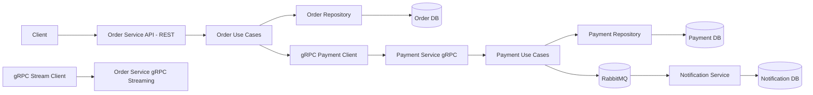
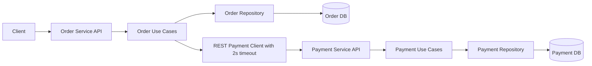

# Advanced Programming 2 - Assignment 3

## Student
- Name: Akbar Khalili
- Course: Advanced Programming 2
- Topic: Event-Driven Architecture (EDA) with Message Queues

## Assignment 3: Event-Driven Architecture with Message Queues

### Scope
- Lecture 5 (Message Queues) & Lecture 6 (Transactions & Reliability)
- Deadline: 02.05.2026 23:59

### Learning Objectives
- Implement Event-Driven Architecture using RabbitMQ
- Manage service life-cycles with Graceful Shutdown
- Ensure Message Reliability using Manual Acknowledgments (ACKs)
- Implement Idempotent Consumers to handle duplicate events safely
- Orchestrate multiple services and infrastructure using Docker Compose

### Scenario: Asynchronous Notifications
After Assignment 2's synchronous gRPC link, we now add a Notification Service with event-driven flow:
Payment Service (Producer) -> Message Broker -> Notification Service (Consumer)

### System Requirements

#### 1. Notification Service (Consumer)
- Listens to `payment.completed` queue
- Logs email notifications: `[Notification] Sent email to user@example.com for Order #123. Amount: $99.99`
- Decoupled from Order and Payment services

#### 2. Payment Service (Producer)
- Publishes events after successful payment (DB transaction committed)
- Payload: JSON with order_id, amount, customer_email, status
- Reliability: Ensures message delivery to broker

#### 3. Reliability & Delivery Guarantees
- **Manual ACKs**: Disabled auto-ack, acknowledge only after successful processing
- **Persistence**: Durable queues survive broker restart
- **Idempotency**: DB-based check to prevent duplicate processing

#### 4. Infrastructure (Docker)
- Everything via `docker-compose up`
- Components: Order, Payment, Notification services + Databases + RabbitMQ

### Architecture Diagram


### Design Quality Standards

#### Best-Case Design (Target)
- **At-least-once delivery**: System never loses messages if consumer crashes
- **Separation of Concerns**: Messaging logic behind interfaces
- **Idempotency**: Clear mechanism for duplicate message filtering
- **Graceful Shutdown**: Using os/signal for proper connection closure

#### Worst-Case Design (Avoid)
- Synchronous coupling between Payment and Notification services
- Auto-ACK losing messages on consumer crash
- No Docker requiring manual RabbitMQ installation

### Implementation Details

#### Idempotency Strategy
The Notification Service uses a PostgreSQL table `processed_events` to track processed event IDs:
- Each event ID (order_id) is stored after successful processing
- Duplicate events are detected and ignored before logging
- Ensures exactly-once processing semantics

#### ACK Logic Implementation
- **Manual ACKs**: Consumer disables auto-ack in `ch.Consume()`
- **QoS=1**: Fair dispatch ensures one message per consumer
- **ACK on Success**: `d.Ack(false)` only after email logging and DB update
- **NACK on Failure**: `d.Nack(false, true)` requeues on processing errors
- **No Requeue on Parse Error**: `d.Nack(false, false)` discards malformed messages

### Services Overview

1. **Order Service** (Port 8081)
   - REST API for order management
   - gRPC server for payment integration
   - PostgreSQL database

2. **Payment Service** (Port 8082)
   - REST API for payment processing
   - gRPC server for order integration
   - RabbitMQ publisher for events
   - PostgreSQL database

3. **Notification Service** (Port 8083)
   - RabbitMQ consumer for payment events
   - Idempotent event processing
   - PostgreSQL database for event tracking

4. **RabbitMQ** (Ports 5672, 15672)
   - Message broker with durable queues
   - Management UI at http://localhost:15672

### Running the System

```bash
# Start all services
docker-compose up --build

# Or run in background
docker-compose up -d --build
```

### Testing the Event Flow

1. **Create Order** (via frontend or API)
2. **Create Payment** (via frontend or API)
3. **Observe Logs**: Notification service logs email notifications
4. **Check RabbitMQ**: Management UI shows queue activity

### Bonus: Dead Letter Queue (DLQ)
For advanced failure handling, configure RabbitMQ with DLQ for messages that fail after 3 retries.
- Owns order lifecycle state: `Pending`, `Paid`, `Failed`, `Cancelled`
- Owns customer/order attributes
- Calls Payment Service for authorization

2. Payment Context
- Owns payment authorization and transaction records
- Enforces payment limit rule
- Never reads or writes order tables

## Clean Architecture Mapping
Each service follows this structure:

- `internal/domain`: Entity and pure domain constants
- `internal/usecase`: Business logic, invariants, and ports (interfaces)
- `internal/repository`: PostgreSQL implementation of repository ports
- `internal/transport/http`: Thin Gin handlers and routing
- `internal/app`: Infrastructure adapters (outbound payment REST client in order-service)
- `cmd/<service>/main.go`: Composition root with manual dependency injection

## Business Rules Covered
1. Money is `int64` (cents) only
2. Amount must be `> 0`
3. Paid orders cannot be cancelled (only Pending can be cancelled)
4. Payment limit:
   - if `amount > 100000`, payment status is `Declined`
5. Order Service uses `http.Client{Timeout: 2 * time.Second}`

## Failure Handling Choice
If Payment Service is unavailable:
1. Order Service request does not hang (timeout max 2 seconds)
2. API returns `503 Service Unavailable`
3. Already-created order is marked as `Failed`

Reasoning:
- Keeps order state explicit and observable for operators/clients
- Avoids indefinite pending records after integration failure

## Architecture Diagram


## Running Locally

### Prerequisites
- Go 1.22+
- PostgreSQL 14+ (running on localhost:5432)
- psql command-line tool

### Quick Start (Windows)

#### 1. Setup PostgreSQL databases and users

Run from project root:
```powershell
# Set postgres password
$env:PGPASSWORD = "postgres"

# Create users and databases
Get-Content "setup.sql" | & "C:\Program Files\PostgreSQL\16\bin\psql.exe" -U postgres -h localhost

# Apply migrations to order database
$env:PGPASSWORD = "1234"
Get-Content "apply_order_migrations.sql" | & "C:\Program Files\PostgreSQL\16\bin\psql.exe" -U order_user -h localhost -d order_db

# Apply migrations to payment database
Get-Content "apply_payment_migrations.sql" | & "C:\Program Files\PostgreSQL\16\bin\psql.exe" -U payment_user -h localhost -d payment_db
```

#### 2. Run payment service
```powershell
cd payment-service
go mod tidy
go run ./cmd/payment-service
```
Payment service runs on: `http://localhost:8082` (REST), `localhost:50051` (gRPC)

#### 3. Run order service (in new terminal)
```powershell
cd order-service
go mod tidy
go run ./cmd/order-service
```
Order service runs on: `http://localhost:8081` (REST), `localhost:50052` (gRPC)

### Docker

```bash
docker compose up --build
```

Services:
- Order Service: `http://localhost:8081` (REST), `localhost:50052` (gRPC)
- Payment Service: `http://localhost:8082` (REST), `localhost:50051` (gRPC)

### Database Credentials

| Service | User | Password | Database | Port |
|---------|------|----------|----------|------|
| Order | order_user | 1234 | order_db | 5432 |
| Payment | payment_user | 1234 | payment_db | 5432 |

## Demonstration for Teacher

To show that everything works, run the demonstration script:

```powershell
.\demonstrate.ps1
```

This will:
1. Check if all services are running
2. Test REST APIs
3. Test gRPC services with grpcurl
4. Demonstrate inter-service gRPC communication
5. Show how to test real-time streaming

### Manual Testing Steps:

#### 1. Start Services
```powershell
# Terminal 1
cd payment-service && go run ./cmd/payment-service

# Terminal 2  
cd order-service && go run ./cmd/order-service
```

#### 2. Test REST APIs
```bash
# Check health
curl http://localhost:8081/health
curl http://localhost:8082/health

# Create order (triggers gRPC call internally)
curl -X POST http://localhost:8081/orders \
  -H "Content-Type: application/json" \
  -d '{"customer_id": "test", "item_name": "item", "amount": 5000}'
```

#### 3. Test gRPC Services
```bash
# List services
grpcurl -plaintext localhost:50051 list
grpcurl -plaintext localhost:50052 list

# Call ProcessPayment directly
grpcurl -plaintext -d '{"order_id": "test-id", "amount": 5000}' \
  localhost:50051 payment.PaymentService/ProcessPayment
```

#### 4. Test Real-time Streaming
```bash
# Terminal 3 - Start streaming client
go run client.go

# Terminal 4 - Create order and cancel it
curl -X POST http://localhost:8081/orders \
  -H "Content-Type: application/json" \
  -d '{"customer_id": "stream-test", "item_name": "streaming item", "amount": 1000}'

# Get order ID from response, then cancel
curl -X PATCH http://localhost:8081/orders/{order-id}/cancel
```

The streaming client will show real-time status updates!

### Process Payment via gRPC
The inter-service communication is now gRPC, but REST APIs are still available for external clients.

### Option 1: Web Frontend (Recommended for Demo)
Open `frontend.html` in your browser to have an interactive UI for testing all endpoints.

**Features:**
- Live API testing with visual response formatting
- Automatic Order ID capture from create responses
- Color-coded status indicators
- Test flow recommendations
- Mobile-friendly interface

```bash
# Simply open in browser:
./frontend.html
```

### Option 2: Postman Collection
Import `AP2_Assignment1.postman_collection.json` into Postman:
1. Download Postman from https://www.postman.com/downloads/
2. File → Import → Select `AP2_Assignment1.postman_collection.json`
3. Set environment variables:
   - `order_service_url`: `localhost:8081`
   - `payment_service_url`: `localhost:8082`
4. Run requests or entire collection

**Includes:**
- All CRUD operations for orders and payments
- Integration test scenarios
- Automated response validation
- Idempotency key handling

### Option 3: curl (Command Line)

#### Order Service Endpoints

**Create Order (Basic)**
```bash
curl -X POST http://localhost:8081/orders \
  -H "Content-Type: application/json" \
  -d '{
    "customer_id": "cust-001",
    "item_name": "Laptop",
    "amount": 15000
  }'
```

**Create Order (With Idempotency Key)**
```bash
curl -X POST http://localhost:8081/orders \
  -H "Content-Type: application/json" \
  -H "Idempotency-Key: unique-key-123" \
  -d '{
    "customer_id": "cust-001",
    "item_name": "Laptop",
    "amount": 15000
  }'
```

**Response (201 Created - Order Paid)**
```json
{
  "id": "550e8400-e29b-41d4-a716-446655440000",
  "customer_id": "cust-001",
  "item_name": "Laptop",
  "amount": 15000,
  "status": "Paid",
  "created_at": "2026-04-05T10:30:00Z"
}
```

**Get Order**
```bash
curl http://localhost:8081/orders/{order_id}
```

**Cancel Order (Only Pending)**
```bash
curl -X PATCH http://localhost:8081/orders/{order_id}/cancel
```

#### Payment Service Endpoints

**Create Payment (Amount < 100000 - Authorized)**
```bash
curl -X POST http://localhost:8082/payments \
  -H "Content-Type: application/json" \
  -d '{
    "order_id": "ord-001",
    "amount": 50000
  }'
```

**Response (201 Created)**
```json
{
  "id": "payment-001",
  "order_id": "ord-001",
  "transaction_id": "txn-550e8400",
  "amount": 50000,
  "status": "Authorized"
}
```

**Create Payment (Amount > 100000 - Declined)**
```bash
curl -X POST http://localhost:8082/payments \
  -H "Content-Type: application/json" \
  -d '{
    "order_id": "ord-002",
    "amount": 150001
  }'
```

**Response (201 Created - but declined)**
```json
{
  "status": "Declined",
  "amount": 150001
}
```

**Get Payment by Order ID**
```bash
curl http://localhost:8082/payments/{order_id}
```

#### Test Scenarios

**Scenario 1: Successful Payment Flow**
```bash
# 1. Create order with amount < 100000
curl -X POST http://localhost:8081/orders \
  -H "Content-Type: application/json" \
  -d '{"customer_id":"cust-1","item_name":"Laptop","amount":15000}'
# Expected: Order with status "Paid"

# 2. Get the order
curl http://localhost:8081/orders/{order_id}
# Expected: Order status is "Paid"

# 3. Try to cancel (should fail)
curl -X PATCH http://localhost:8081/orders/{order_id}/cancel
# Expected: 409 Conflict - "cannot cancel paid order"
```

**Scenario 2: Declined Payment (Exceeds Limit)**
```bash
# Create order with amount > 100000
curl -X POST http://localhost:8081/orders \
  -H "Content-Type: application/json" \
  -d '{"customer_id":"cust-2","item_name":"Mercedes","amount":150001}'
# Expected: Order with status "Failed"
```

**Scenario 3: Idempotency Testing**
```bash
# Send same request twice with same Idempotency-Key
# Should return 201 first time, 200 second time (already processed)
curl -X POST http://localhost:8081/orders \
  -H "Content-Type: application/json" \
  -H "Idempotency-Key: order-idem-123" \
  -d '{"customer_id":"cust-3","item_name":"Phone","amount":50000}'

# Same request again
curl -X POST http://localhost:8081/orders \
  -H "Content-Type: application/json" \
  -H "Idempotency-Key: order-idem-123" \
  -d '{"customer_id":"cust-3","item_name":"Phone","amount":50000}'
# Expected: Returns same order (no duplicate)
```

**Scenario 4: Service Unavailability (Manual Test)**
1. Stop Payment Service: Ctrl+C in payment service terminal
2. Try to create order:
   ```bash
   curl -X POST http://localhost:8081/orders \
     -H "Content-Type: application/json" \
     -d '{"customer_id":"cust-4","item_name":"Tablet","amount":30000}'
   ```
3. Expected: 503 Service Unavailable (after 2-second timeout)
4. Order will be marked as "Failed"

### PowerShell Examples (Windows)

```powershell
# Create order (authorized)
$auth_body = @{customer_id="cust-win-1"; item_name="Laptop"; amount=15000} | ConvertTo-Json
Invoke-WebRequest -Uri "http://localhost:8081/orders" `
  -Method POST `
  -ContentType "application/json" `
  -Body $auth_body

# Create order (declined)
$decline_body = @{customer_id="cust-win-2"; item_name="Mercedes"; amount=150001} | ConvertTo-Json
Invoke-WebRequest -Uri "http://localhost:8081/orders" `
  -Method POST `
  -ContentType "application/json" `
  -Body $decline_body

# Get order
Invoke-WebRequest -Uri "http://localhost:8081/orders/{order_id}" -Method GET

# Cancel order
Invoke-WebRequest -Uri "http://localhost:8081/orders/{order_id}/cancel" -Method PATCH

# Create payment
$payment_body = @{order_id="ord-001"; amount=50000} | ConvertTo-Json
Invoke-WebRequest -Uri "http://localhost:8082/payments" `
  -Method POST `
  -ContentType "application/json" `
  -Body $payment_body

# Get payment
Invoke-WebRequest -Uri "http://localhost:8082/payments/{order_id}" -Method GET
```

## Submission
Zip the whole project folder as:
- `AP2_Assignment1_name_surname_group.zip`

### Included in Submission
- ✅ Both service source code (clean architecture implementation)
- ✅ SQL migration scripts for each service
- ✅ README.md (this file with comprehensive documentation)
- ✅ Architecture diagram (in README and mermaid format)
- ✅ **frontend.html** - Interactive web UI for API testing
- ✅ **AP2_Assignment1.postman_collection.json** - Postman collection for testing
- ✅ docker-compose.yml - Docker setup (optional)
- ✅ run.ps1 - PowerShell startup script for Windows
- ✅ Database migration scripts

### For Defense Presentation

**Prepare to demonstrate:**
1. Run the frontend.html and show:
   - Create successful order (Paid)
   - Create failed order (Declined - exceeds limit)
   - Cancel pending order (works)
   - Try to cancel paid order (fails with 409 Conflict)

2. Use Postman collection to show:
   - All CRUD endpoints working
   - Request/response examples
   - Idempotency in action
   - Error handling (503 for unavailable service)

3. Show code quality:
   - Clean architecture layers (domain, usecase, repository, transport)
   - No shared database between services
   - Timeout implementation (2 seconds)
   - Business rule enforcement

**Questions to prepare for:**
- Why use int64 for money? (Answer: Avoid floating-point precision errors)
- How does idempotency prevent duplicate orders? (Answer: Check Idempotency-Key header)
- What happens if Payment Service is down? (Answer: Returns 503, marks order as Failed)
- Why each service has its own database? (Answer: Microservices principle - bounded contexts)
- How is the timeout enforced? (Answer: http.Client{Timeout: 2*time.Second})
